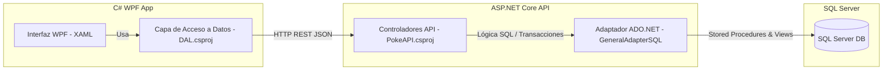

# ItemsUTN 🎮📦
## Proyecto del Curso de C# .NET — Universidad Tecnológica Nacional (UTN)

Este repositorio contiene los materiales de estudio, las guías teóricas oficiales de la cátedra y la solución del **Trabajo Práctico Integrador** para el curso de desarrollo en C# .NET. La solución implementa una arquitectura distribuida cliente-servidor, compuesta por un backend en **ASP.NET Core Web API** y un cliente de escritorio en **WPF (Windows Presentation Foundation)**.

---

## 📁 Estructura del Repositorio

El repositorio se divide en documentación oficial y código fuente:

*   **`Trabajo Practico Curso C#.pdf`:** Consigna oficial del trabajo práctico final a desarrollar durante la cursada, detallando los requerimientos de negocio.
*   **`Unidad Nº 2 API REST.pdf`:** Apunte teórico sobre el diseño, arquitectura y consumo de servicios API REST en .NET.
*   **`Unidad N º 3 WPF.pdf`:** Apunte teórico para el desarrollo de interfaces de escritorio ricas y modernas con Windows Presentation Foundation (WPF) y XAML.
*   **`Items/`:** Directorio principal que aloja las dos soluciones de software:
    *   **`PokeAPICurso-Implementacion/` (Backend):**
        *   **`PokeAPI`:** Aplicación de servidor ASP.NET Core Web API. Expone endpoints RESTful para la administración de Pokémon (`PokemonController`), ítems (`ItemsController`) y simulación transaccional de combates (`CombateController`). Cuenta con soporte de Swagger/OpenAPI.
        *   **Scripts SQL:**
            *   `PokeBaseInicio.sql`: Inicialización del esquema de base de datos relacional y carga de datos semilla (tipos de Pokémon, entrenadores, etc.).
            *   `ABMC Script.sql`: Procedimientos almacenados para las operaciones de ABMC (Alta, Baja, Modificación y Consulta) de Pokémon e ítems.
            *   `Transaccion.sql`: Procedimientos almacenados complejos para simular combates persistidos bajo transacciones relacionales SQL.
            *   `PermisosLog.sql`: Creación del sistema de logs de error y gestión de permisos de base de datos.
    *   **`PokeDexCurso-PokemonABMC/` (Frontend / Cliente):**
        *   **`PokeDex`:** Aplicación WPF en C# y XAML que proporciona la interfaz gráfica de usuario (GUI) para interactuar con la Pokedex.
        *   **`DAL` (Data Access Layer):** Biblioteca de clases que encapsula el consumo de la API mediante `HttpClient` (`GeneralAdapterAPIRest.cs`), desacoplando la lógica de la interfaz del protocolo HTTP.

---

## 🧠 Arquitectura de la Solución

El sistema sigue una arquitectura de capas distribuidas comunicadas mediante HTTP/REST:



---

## 🛠️ Tecnologías y Frameworks Utilizados

*   **Plataforma principal:** .NET C#
*   **Backend API:** ASP.NET Core Web API, Swagger/OpenAPI (para documentación interactiva).
*   **Desktop UI:** Windows Presentation Foundation (WPF), XAML, Views.
*   **Acceso a Base de Datos:** ADO.NET (`SqlConnection`, `SqlCommand`, `DataTable` en `GeneralAdapterSQL.cs`).
*   **Motor de Base de Datos:** SQL Server (Compatible con LocalDB o Express).
*   **Serialización de Datos:** Newtonsoft.Json, System.Net.Http.Json.

---

## 🚀 Configuración y Puesta en Marcha

Para compilar y ejecutar el proyecto localmente, siga estos pasos:

### 1. Configuración de la Base de Datos (SQL Server)
1. Conéctese a su instancia de SQL Server (ej. `(LocalDB)\MSSQLLocalDB` o `.\SQLEXPRESS`).
2. Abra y ejecute en orden los scripts SQL ubicados en `Items/PokeAPICurso-Implementacion/PokeAPI/`:
    1.  `PokeBaseInicio.sql` (creación de la base de datos e inserciones iniciales).
    2.  `ABMC Script.sql` (procedimientos almacenados CRUD).
    3.  `Transaccion.sql` (procedimientos transaccionales para combates).
    4.  `PermisosLog.sql` (esquema de log).

### 2. Configuración y Ejecución del Backend (`PokeAPI`)
1. Abra el directorio `Items/PokeAPICurso-Implementacion/PokeAPI/` o la solución `PokeAPI.sln` en Visual Studio.
2. Abra el archivo `appsettings.json`.
3. Configure la clave `"Env"` (por ejemplo `"DESA"`) y ajuste su correspondiente cadena de conexión dentro de `"ConnectionStrings"` para que apunte a su instancia local de SQL Server.
    ```json
    "Env": "DESA",
    "ConnectionStrings": {
      "DESA": "Data Source=(LocalDB)\\MSSQLLocalDB;AttachDbFilename=Ruta_A_Tu_PokeDB.mdf;Integrated Security=True;Connect Timeout=30"
    }
    ```
4. Ejecute el proyecto (F5 o `dotnet run`).
5. Se abrirá la documentación Swagger en el navegador (habitualmente en `https://localhost:<puerto>/swagger`). Pruebe los endpoints para verificar la conectividad con la base de datos.

### 3. Configuración y Ejecución del Cliente WPF (`PokeDex`)
1. Abra la solución `PokeDex.sln` en `Items/PokeDexCurso-PokemonABMC/` con Visual Studio.
2. Abra el archivo `GeneralAdapterAPIRest.cs` en el proyecto **DAL** (`DAL/Adapters/GeneralAdapterAPIRest.cs`).
3. Modifique la variable `BaseAdress` para que coincida con el puerto HTTPS donde se está ejecutando el backend (ej. `https://localhost:1984/` u otro puerto asignado).
    ```csharp
    private string BaseAdress = "https://localhost:<PUERTO_API>/";
    ```
4. Configure el proyecto `PokeDex` como proyecto de inicio y ejecútelo.
5. Utilice la interfaz gráfica para listar, dar de alta, modificar y eliminar Pokémon. Las solicitudes se enviarán en tiempo real al backend y se persistirán en la base de datos SQL Server.
